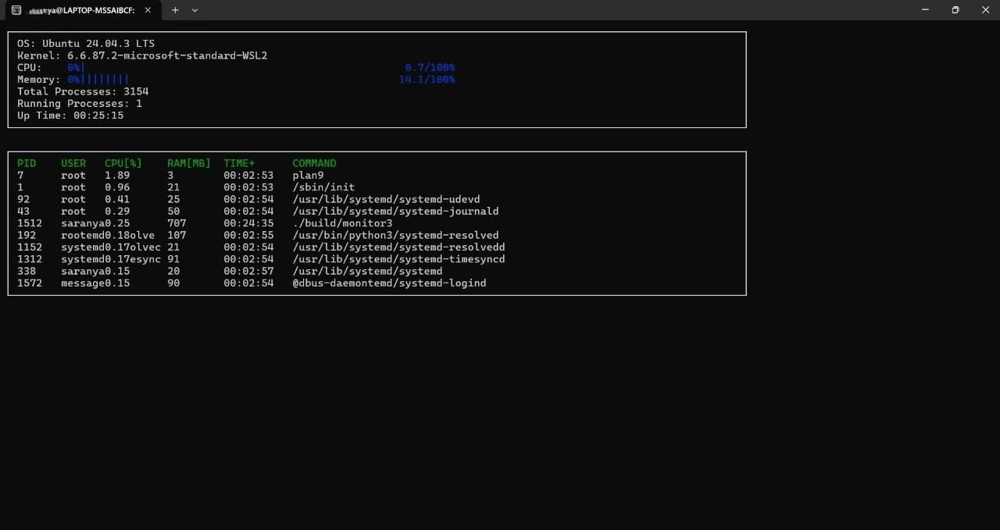

# 🖥️ System Monitor Tool (Linux System Programming - Assignment 3)

A Linux-based **System Monitoring Tool** implemented in **C++** using the `/proc` filesystem and Linux System Programming concepts.  
It displays **real-time CPU usage, memory usage, and running processes** similar to the `top` command.

---

## 👤 Student Information

| Field | Details |
|------|---------|
| **Name** | T. S. Kaushik |
| **Registration No** | 2241011036 |
| **College** | ITER, SOA University |
| **Branch** | CSIT |
| **Course** | B.Tech |
| **Subject** | Linux System Programming (LSP) |

---

## 📌 Features

✔ Real-Time CPU Monitoring  
✔ Real-Time Memory Monitoring  
✔ Lists Running Processes  
✔ Shows CPU & RAM Usage Per Process  
✔ Kill Any Process Using PID  
✔ Lightweight Terminal UI  
✔ Works in Linux / Ubuntu / WSL  

---

## 🛠️ Technologies Used

| Component | Technology Used |
|----------|----------------|
| Programming Language | C++ |
| Operating System | Linux / Ubuntu / WSL |
| Concepts | `/proc` filesystem, Signals, File I/O |

---

## 📸 Output Screenshot

> System Monitor running inside WSL Linux Terminal 👇



---

## 🚀 How to Run

### ✅ Compile

```bash
g++ system_monitor.cpp -o monitor
